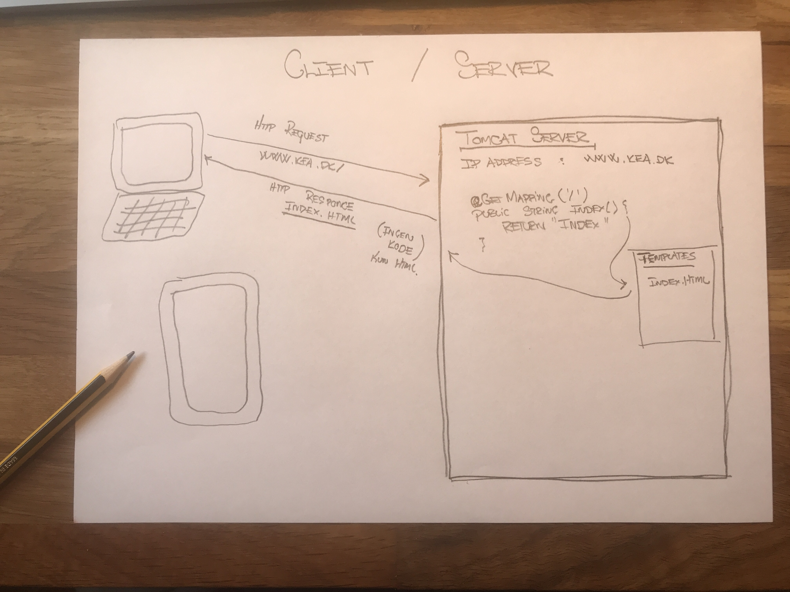

<script src="https://code.jquery.com/jquery-3.2.1.min.js"></script>
<script src="script.js"></script>


# Client / Server arkitektur 

## Læringsmål
* Du skal kunne beskrive Clientens (feks. browseren) og Serverens (feks. Tomcat) ansvarsområder. (Ex. hvor bliver koden i et konkret eksempel eksekveret)  
* Du skal have en basal forståelse af HTTP protokollen, herunder kunne forklare forskellen på GET og POST og vise hvordan i kan bruge det.
* Du skal forstå Request/Response i forhold til en Spring Boot Applikation.
* Du skal forstå og kunne bruge @GetMapping og @PostMapping i en Spring Boot Applikation. 
* Kunne bruge browserens inspect tool til at analysere en webapplikations request & responces. 

## materiale
**(update)**    
freemysqlhosting.net er kun gratis i 3 dage.     
De 2 følgende tutorials viser hvordan i kan oprette og bruge "ClearDB" som jeres online tilgængelige database i forbindelse med hosting på Heroku.

* [Tutorial: opret en ClearDB database](materialer/cleardb.md)
* [Tutorial: hosting af spring boot web app his heruko]()


* [client–server model](https://en.wikipedia.org/wiki/client%e2%80%93server_model)
* [hypertext transfer protocol (http)](https://www.khanacademy.org/computing/computers-and-internet/xcae6f4a7ff015e7d:the-internet/xcae6f4a7ff015e7d:web-protocols/a/hypertext-transfer-protocol-http)
* [Kodeeksempel fra undervisningen](https://github.com/techkea/client_server_dat21v)


### ip adresser og domain name server

### client / server

### hvad foregår på serveren og hvad foregår på klienten?


## øvelser
### Et ultra simpelt Spring Boot projekt.
Lav et ultra simpelt spring boot projekt. Projektet skal minde meget om det i lige har fået demonstreret af Claus.   

#### Del 1    
 
2. Projektet skal have følgende dependencies:	
	* Web: Spring Web
	* Template engines: Thymeleaf
	* SQL: MySql Driver
3. Projektet skal have en controller package med en klasse i som hedder HomeController.
	* I HomeController klassen skal i have en index metode som returnerer en index.html side
	* index.html siden skal ligge i Templates mappen og have et 
		
        ````
		<h1>Dagens Citat</h1>
		<p>Topstyrret social ingenørkunst</p>
	````
4. Kør projektet og åben det via http://localhost:8080
5. Fra din mobiltelefon prøv om du kan se siden som kommer fra din computer. (Computer er serveren mobilen er clienten).
6. Forklar (for din gruppe, eller dig selv) flowet (step by step og så detaljeret som muligt) fra at du skriver 192.168.0.16:8080 (eller en anden adresse) til at du får et http response tilbage fra serveren.

#### Del 2
1. Tilføj et logo (billede) til din html side, og et eksternt style sheet.
	* Stylesheetet skal ligge i static mappen.
2. Med fokus på billedet og styleshettet. Forklar (for din gruppe, eller dig selv) flowet (step by step, og så detaljeret som muligt) fra at du skriver 192.168.0.16:8080 (eller en anden adresse) til at du får et http response tilbage fra serveren.  

#### Del 3
1. Tilføl 2 metoder til din controller.
	* De skal begge have navnet citat()
	* Den ene skal reagerer på et **Get request** og den anden på et **Post Request**.
2. Du skal lave en tilhørende citat.html side som indeholder en form og tager imod input (et nyt citat).
3. Med fokus på det nye kode. Forklar (for din gruppe, eller dig selv) flowet (step by step, og så detaljeret som muligt) fra at du skriver 192.168.0.16:8080/citat (eller en anden adresse) til at du får et http response tilbage fra serveren. 


 
